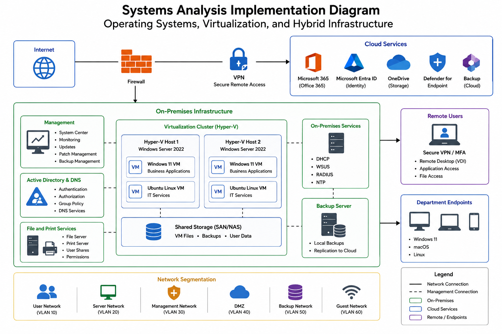

# Operating Systems and Virtualization Portfolio

A systems analysis portfolio demonstrating operating system planning, hardware compatibility, virtualization, security, migration strategy, and structured troubleshooting.

## About the Project

This project examines how an organization can modernize an environment that uses Windows, macOS, and Linux systems. The analysis considers operating system compatibility, hardware requirements, business applications, security, virtualization, remote access, and future growth.

The recommended approach uses Windows 11 as the primary operating system for most departments while maintaining macOS for creative work and Linux for specialized IT functions. The environment also combines physical infrastructure, cloud services, and virtualization to support business operations and remote employees.

## Skills Demonstrated

- Operating system planning and analysis
- Windows, macOS, and Linux environments
- Hardware and software compatibility
- Windows 11 migration planning
- Virtualization and virtual machines
- Virtual desktop infrastructure (VDI)
- Cloud and hybrid infrastructure
- Security and system support considerations
- Application compatibility analysis
- Structured troubleshooting
- Root cause analysis
- System recovery and verification

 ## Operating System Analysis

The organization uses a combination of Windows, macOS, and Linux systems across different departments. Most employees rely on Windows for daily business applications, while macOS supports creative and multimedia work and Linux supports specialized IT functions. Older Windows systems can create security, compatibility, and maintenance concerns as technology and software requirements change.

The recommended approach is to standardize most departments on Windows 11 while continuing to use macOS where creative applications are needed and Linux where it supports IT administration and technical functions. This approach improves consistency, security, application compatibility, and system management without removing operating systems that support specialized business needs.

## Hardware and Application Compatibility

Operating system planning also requires reviewing whether existing hardware and business applications can support the recommended environment. The organization relies on applications such as Microsoft Office 365, SAP, ServiceNow, SolarWinds, and Adobe products, so compatibility must be considered before systems are upgraded or replaced.

Devices that cannot meet Windows 11 hardware requirements may need to be upgraded or replaced. Application compatibility, device drivers, memory, storage, and processor requirements should also be reviewed before deployment. Testing systems before a full rollout can help identify compatibility problems and reduce disruption to employees.

## Virtualization and Hybrid Infrastructure

Virtualization allows multiple operating systems and applications to run on shared physical hardware through the use of virtual machines and a hypervisor. This can reduce hardware requirements, improve resource utilization, simplify system management, and provide flexible environments for testing, development, and business applications.

Virtual desktop infrastructure (VDI) can also provide employees with secure remote access to standardized desktop environments. A hybrid approach that combines physical systems, virtual machines, and cloud services can support scalability, remote work, centralized management, and business continuity while allowing resources to be adjusted as organizational needs change.

Virtualized environments still require strong security controls, system monitoring, access management, backups, and network protection. Administrators must also monitor resource usage so that virtual machines receive enough processing power, memory, storage, and network capacity to operate effectively.

### Systems Architecture Diagram

## Structured Systems Troubleshooting

A structured troubleshooting process helps identify the cause of an operating system problem before changes are made. The process includes gathering information, identifying recent changes, creating a hypothesis, testing the most likely cause, applying the appropriate correction, verifying the result, and documenting the resolution.

### Operating System Upgrade Failure

When a system experienced a blue screen after an operating system upgrade, the recent upgrade was identified as the most important change. Possible causes included incompatible or corrupted device drivers and damaged operating system files. Troubleshooting included Safe Mode, driver review, Startup Repair, and verification that the system could start and operate normally after corrective actions were completed.

### Operating System Boot Failure

When a computer displayed an error while loading the operating system, possible causes included incorrect BIOS or UEFI boot settings, damaged boot records, corrupted system files, or hard-drive problems. Troubleshooting included verifying the correct boot device, using recovery tools, performing Startup Repair, checking the drive for errors, and confirming that the operating system loaded successfully after repair.

## Migration and Implementation Strategy

A phased implementation can reduce risk when modernizing an operating system environment. Before deployment, existing hardware and applications should be reviewed for compatibility, important data should be backed up, and systems should be tested to identify potential issues before changes affect a larger group of employees.

The migration can begin with a smaller group of compatible systems before expanding to additional departments. Systems that do not meet hardware requirements can be upgraded or replaced, while specialized macOS and Linux environments can remain in place where they support specific business needs.

After deployment, systems should be monitored for application compatibility, driver issues, security updates, and user access problems. Documenting results and addressing issues during each phase can help support a more controlled transition and reduce business disruption.

## Key Takeaways

This project helped me strengthen my understanding of:

- Evaluating operating systems based on business and technical requirements
- Comparing Windows, macOS, and Linux environments
- Assessing hardware and application compatibility
- Planning operating system migrations
- Understanding virtualization, virtual machines, and VDI
- Evaluating cloud and hybrid infrastructure
- Applying security and system management considerations
- Troubleshooting operating system failures systematically
- Identifying possible root causes before applying changes
- Verifying and documenting system resolutions

I am continuing to develop my systems analysis and information technology skills through hands-on work with operating systems, virtualization, troubleshooting, security, and infrastructure technologies.
